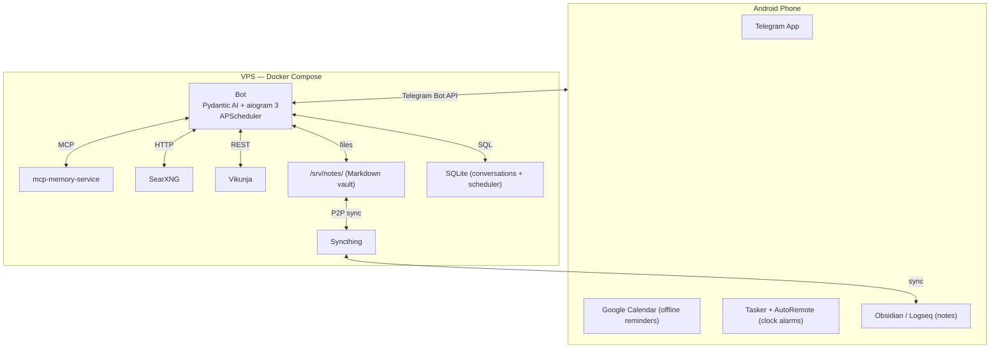

# Telegram AI Personal Assistant

A self-hosted, privacy-respecting personal AI assistant accessible via Telegram.
Conversations, memory, notes, tasks, calendar events, and alarms — all from your phone.
Runs on a Linux VPS. Developed locally on Windows via WSL2.

---

## What It Does

| Feature | How |
|---|---|
| Conversational AI via Telegram | Pydantic AI agent + aiogram 3 |
| LLM provider | OpenCode Go (`https://opencode.ai/zen/go/v1`) |
| Persistent memory across sessions | mcp-memory-service (Docker) |
| Session management (list / open / close / resume) | Custom SQLite — sessions + turns |
| Note-taking synced to phone + PC | Markdown files + Syncthing |
| Task management | Vikunja (self-hosted REST API) |
| Google Calendar — create events + reminders | Custom MCP wrapper (googleapis) |
| Native Android alarms (offline-capable) | Tasker + AutoRemote |
| Web search | SearXNG (self-hosted, 70+ engines, no API key) |
| Web page reading | Jina Reader → rebrowser-Playwright fallback |
| Proactive scheduled check-ins | APScheduler + SQLAlchemyJobStore |

---

## Architecture

See [architecture/overview.md](architecture/overview.md) for the full diagram and layer dependency rules.



---

## Documentation Map

| Document | Contents |
|---|---|
| [spec.md](spec.md) | Goals, acceptance criteria, out of scope |
| [architecture/overview.md](architecture/overview.md) | System architecture, bounded contexts, layer rules, service topology |
| [architecture/tech-stack.md](architecture/tech-stack.md) | All technologies with versions and justifications |
| [architecture/ubiquitous-language.md](architecture/ubiquitous-language.md) | Domain vocabulary — naming rules |
| [architecture/decisions/](architecture/decisions/) | ADRs for all key architectural decisions |
| [implementation/phase-0-bootstrap.md](implementation/phase-0-bootstrap.md) | Project scaffolding from blank repo |
| [implementation/phase-1-bot-skeleton.md](implementation/phase-1-bot-skeleton.md) | Core bot + sessions + agent loop |
| [implementation/phase-2-memory.md](implementation/phase-2-memory.md) | Long-term memory MCP |
| [implementation/phase-3-research.md](implementation/phase-3-research.md) | Web search + page fetching + Playwright |
| [implementation/phase-4-notes.md](implementation/phase-4-notes.md) | Markdown notes vault + Syncthing |
| [implementation/phase-5-tasks.md](implementation/phase-5-tasks.md) | Vikunja task management |
| [implementation/phase-6-checkins-sessions.md](implementation/phase-6-checkins-sessions.md) | Proactive check-ins + session Telegram UX |
| [implementation/phase-7-calendar-alarms.md](implementation/phase-7-calendar-alarms.md) | Google Calendar + Tasker alarms |
| [implementation/phase-8-sandbox.md](implementation/phase-8-sandbox.md) | Code execution sandbox (lowest priority) |
| [verification/acceptance-checklist.md](verification/acceptance-checklist.md) | Final acceptance checklist |

---

## Local Development (WSL2 + Docker)

> **Critical:** Clone this repo inside WSL2 (`~/assistant/`), **never** in `/mnt/c/`.
> Cross-filesystem Docker volume mounts degrade I/O by 5–20x on WSL2.

```bash
# Inside WSL2 terminal
git clone <repo-url> ~/assistant
cd ~/assistant

cp .env.example .env
# Edit .env — see architecture/tech-stack.md for all required variables

docker compose -f deploy/docker-compose.yml \
               -f deploy/docker-compose.override.yml \
               up -d
```

The `override.yml` bind-mounts `./src` into the bot container — code changes are live without rebuilding.

---

## Production Deployment (Linux VPS)

```bash
git clone <repo-url> /opt/assistant
cd /opt/assistant
cp .env.example .env
# Edit .env

docker compose -f deploy/docker-compose.yml up -d
```

---

## Costs

| Item | Cost |
|---|---|
| VPS (e.g. Hetzner CX22: 2 vCPU / 4GB / 40GB) | ~€4/month |
| Tasker (one-time, Google Play) | $3.49 |
| AutoRemote | Free |
| Everything else | Free (self-hosted or free-tier external) |

---

## Future Features (Backlog)

- CAPTCHA relay: Playwright detects challenge → screenshot → Telegram → user solves → retry
- Voice message transcription (Whisper)
- Email integration (Gmail MCP)
- Web UI / admin dashboard
