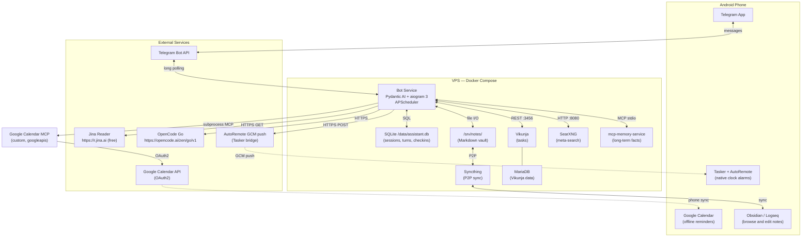

# Architecture Overview

## System Context



---

## Bounded Contexts

| Context | DDD Type | Responsibility |
|---|---|---|
| `conversation` | **Core** | Session lifecycle, turn storage, context window management, title generation |
| `agent` | **Core** | Pydantic AI agent definition, tool registration, MCP client management, per-turn orchestration |
| `research` | Supporting | Web search (SearXNG), page fetching (Jina), browser automation fallback (rebrowser-Playwright) |
| `notes` | Supporting | Markdown vault read/write; note search by content |
| `scheduler` | Supporting | Proactive check-in definitions (cron + prompt), APScheduler lifecycle |
| `memory` | Supporting | Anti-Corruption Layer over mcp-memory-service REST API |
| `calendar` | Generic | ACL over Google Calendar API; event creation and listing |
| `tasks` | Generic | ACL over Vikunja REST API; task CRUD |
| `alarms` | Generic | ACL over AutoRemote HTTP push → Tasker device |

**Core subdomains** have domain entities, repository interfaces, and application use cases.
**Supporting subdomains** have typed value objects and application use cases; no complex invariants.
**Generic subdomains** have application use cases and infrastructure clients only — no domain layer.

---

## Layer Architecture

```
┌───────────────────────────────────────────────────────┐
│  Interface Layer  (src/assistant/telegram/)           │
│  aiogram handlers, inline keyboard builders           │
│  Receives Telegram updates; delegates to application  │
│  MUST NOT contain business logic or SQL               │
└──────────────────────────────┬────────────────────────┘
                               │
┌──────────────────────────────▼────────────────────────┐
│  Application Layer  (src/assistant/*/application/)    │
│  One use case per file; named as verb-noun            │
│  Orchestrates domain objects + infrastructure         │
│  MUST NOT contain persistence drivers or HTTP clients │
└──────────────────────────────┬────────────────────────┘
                               │
┌──────────────────────────────▼────────────────────────┐
│  Domain Layer  (src/assistant/*/domain/)              │
│  Entities, Value Objects, Repository interfaces       │
│  Pure Python — zero framework or infrastructure deps  │
│  MUST NOT import: sqlalchemy, httpx, aiogram, etc.    │
└──────────────────────────────┬────────────────────────┘
                               │
┌──────────────────────────────▼────────────────────────┐
│  Infrastructure Layer  (src/assistant/*/infrastructure/) │
│  SQLite repositories, HTTP clients, MCP clients       │
│  File system adapters; implements domain interfaces   │
│  MUST NOT contain business logic or domain rules      │
└───────────────────────────────────────────────────────┘
```

**Dependency rule:** outer layers depend inward. The domain layer depends on nothing outside `shared/`.

### Import Violations (Never Allowed)

```python
# VIOLATION: domain importing infrastructure
# src/assistant/conversation/domain/session.py
from sqlalchemy.orm import Session  # ❌

# VIOLATION: telegram handler containing business logic
# src/assistant/telegram/handlers/message.py
async def on_message(message: Message):
    sessions = await db.execute("SELECT * FROM sessions")  # ❌

# VIOLATION: application layer importing HTTP client directly
# src/assistant/conversation/application/close_session.py
import httpx  # ❌ — use injected repository/client interface
```

---

## Full Folder Structure

```
assistant/                              ← project root (clone inside WSL2 at ~/assistant/)
│
├── .github/
│   └── instructions/
│       └── ARCHITECTURE.instructions.md
│
├── src/
│   └── assistant/
│       ├── main.py                     ← entry point: bot + scheduler + MCP clients
│       │
│       ├── telegram/                   ← Interface layer
│       │   ├── bot.py                  ← Dispatcher + router setup
│       │   ├── handlers/
│       │   │   ├── message.py          ← incoming user messages → run_turn use case
│       │   │   ├── session_commands.py ← /new, /close, /sessions
│       │   │   └── callbacks.py        ← inline keyboard callbacks (session list)
│       │   └── keyboards.py
│       │
│       ├── conversation/               ← Core bounded context
│       │   ├── domain/
│       │   │   ├── session.py          ← Session entity + status transitions
│       │   │   ├── turn.py             ← Turn entity
│       │   │   ├── context_window.py   ← ContextWindow domain service (truncation)
│       │   │   └── repositories.py     ← SessionRepository + TurnRepository interfaces
│       │   ├── application/
│       │   │   ├── open_session.py
│       │   │   ├── close_session.py
│       │   │   ├── resume_session.py
│       │   │   ├── list_sessions.py
│       │   │   └── build_context.py    ← assembles turn list for LLM injection
│       │   └── infrastructure/
│       │       └── sqlite_repositories.py
│       │
│       ├── agent/                      ← Core bounded context
│       │   ├── domain/
│       │   │   └── agent.py            ← Pydantic AI Agent, all tool registrations
│       │   ├── application/
│       │   │   └── run_turn.py         ← use case: load context → run agent → save turn
│       │   └── tools/                  ← one file per external domain
│       │       ├── memory_tools.py
│       │       ├── notes_tools.py
│       │       ├── research_tools.py
│       │       ├── calendar_tools.py
│       │       ├── task_tools.py
│       │       ├── alarm_tools.py
│       │       └── checkin_tools.py
│       │
│       ├── research/                   ← Supporting bounded context
│       │   ├── domain/
│       │   │   └── search_result.py    ← SearchResult value object
│       │   ├── application/
│       │   │   ├── search_web.py
│       │   │   └── fetch_page.py       ← Jina → Playwright fallback
│       │   └── infrastructure/
│       │       ├── searxng_client.py
│       │       ├── jina_client.py
│       │       └── rebrowser_client.py
│       │
│       ├── notes/                      ← Supporting bounded context
│       │   ├── domain/
│       │   │   ├── note.py             ← Note value object
│       │   │   └── note_repository.py  ← NoteRepository interface
│       │   ├── application/
│       │   │   ├── save_note.py
│       │   │   └── find_notes.py
│       │   └── infrastructure/
│       │       └── markdown_repository.py
│       │
│       ├── calendar/                   ← Generic subdomain
│       │   ├── application/
│       │   │   ├── create_event.py
│       │   │   └── list_upcoming_events.py
│       │   └── infrastructure/
│       │       └── google_calendar_client.py
│       │
│       ├── tasks/                      ← Generic subdomain
│       │   ├── application/
│       │   │   ├── create_task.py
│       │   │   ├── list_tasks.py
│       │   │   └── complete_task.py
│       │   └── infrastructure/
│       │       └── vikunja_client.py
│       │
│       ├── alarms/                     ← Generic subdomain
│       │   ├── domain/
│       │   │   └── alarm.py            ← Alarm value object (fire_at, label)
│       │   ├── application/
│       │   │   └── schedule_alarm.py
│       │   └── infrastructure/
│       │       └── autoremote_client.py
│       │
│       ├── scheduler/                  ← Supporting bounded context
│       │   ├── domain/
│       │   │   └── scheduled_checkin.py ← entity: name, cron_expr, system_prompt, enabled
│       │   ├── application/
│       │   │   ├── register_checkin.py
│       │   │   ├── toggle_checkin.py
│       │   │   ├── delete_checkin.py
│       │   │   ├── list_checkins.py
│       │   │   └── run_checkin.py      ← APScheduler job payload
│       │   └── infrastructure/
│       │       └── apscheduler_registry.py
│       │
│       ├── memory/                     ← Supporting bounded context (thin ACL)
│       │   └── infrastructure/
│       │       └── memory_mcp_client.py
│       │
│       └── shared/
│           ├── config.py               ← pydantic-settings typed config
│           ├── logging.py              ← structlog setup
│           └── exceptions.py          ← base exception hierarchy
│
├── tests/
│   ├── unit/
│   │   ├── conversation/
│   │   └── scheduler/
│   └── integration/
│
├── deploy/
│   ├── docker-compose.yml
│   ├── docker-compose.override.yml     ← dev: bind-mount src/, expose debug ports
│   ├── searxng/
│   │   └── settings.yml
│   └── syncthing/
│
├── scripts/
│   ├── setup_google_oauth.py           ← one-time headless OAuth flow
│   └── test_tasker_alarm.py            ← Phase 7a device validation
│
├── Dockerfile
├── .env.example
├── pyproject.toml
├── README.md
└── .gitignore
```

---

## Docker Services

| Service | Image | Internal Port | Persistent Volume |
|---|---|---|---|
| `bot` | Custom `Dockerfile` | — | `sqlite_data:/data` |
| `memory` | `doobidoo/mcp-memory-service` | 8001 | `memory_data:/app/data` |
| `searxng` | `searxng/searxng` | 8080 | bind: `./deploy/searxng:/etc/searxng` |
| `vikunja` | `vikunja/vikunja` | 3456 | `vikunja_data:/app/data` |
| `vikunja_db` | `mariadb:10` | 3306 | `vikunja_db_data:/var/lib/mysql` |
| `syncthing` | `syncthing/syncthing` | 8384, 22000 | `notes_data:/var/syncthing` |

All services share an internal `assistant_net` Docker network. Only the `bot` service requires outbound internet access.
